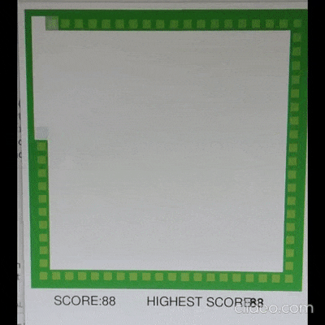
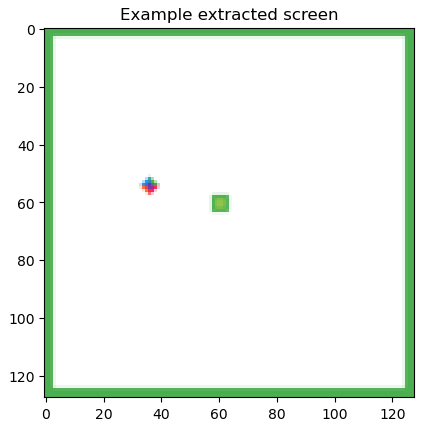

# Modified Snake Game
This repository is an extension based on an existing reinforcement learning [snake repo](https://github.com/maurock/snake-ga).
With the Deep Q-Learning Network the snakes were able to direct themselves to food placed on the grid.

However, we are interested on a new different task. If the snake able to walk 2 steps (removing the food in the game), the snake length will extend and increase the game score.

To implement this algorithm, we simply swap a snake has eaten boolean condition not based on their coordinates equal to food coordinates `x_player==x_food && y_player=y_food`, but rather iterating internal state which reset every time the snake extend itself `player_internal_state==n`, n is the targeted steps before the snake extends itselves and the internal state reset.

For the DQN, input difference, we drop 11 sensory input to 7, due to 8-11 is about direction of food which now are irrelevant. From our early testing, we found the default reward of +10 and -10 if crash not suitable due to +10 reward for doing anything in early game is too big of a reward and overpowering. We change the reward to +1, +0.1 and we found the +1 reward perform best and most stable as seen of table below. Lastly we also increase discount factor from 0.9 to 0.99.

### Training Data
| Reward | Total Score | Average   | Std     |
|--------|-------------|-----------|---------|
| 0.1    | 19877       | 79.5      | 81.7    |
| 1      | **28022**   | **112.1** | **5.7** |
| 10     | 2050        | 8.2       | 82.1    |

### Test Data
| Reward | Total Score | Average   | Std                    |
|--------|-------------|-----------|------------------------|
| 0.1    | 1335        | 13.35     | **19.483935366699853** |
| 1      | **7755**    | **77.57** | 55.96052992146259      |
| 10     | 1369        | 13.69     | 22.719944070922764     |

### Results


Above is the results of the snake on different tasks (Ubuntu screen recorder have a bug, pardon the camera). We found interestingly the snake have found strategy to not crash, but due to limited input, the snake often stuck on loop inside, trapping itself, ending the game early.

# OpenAI Gym Environment

For the snake program itself, we are interested to integrate the program around [OpenAI Gym](https://www.gymlibrary.dev/), a commonly used environment in reinforcement learning development and research.

First do not forget to move inside the directory before running any scripts inside the directory. 
```
cd snake-gym-1.3
pip install gym # You need to have installed the requirements.txt from 1.1
```
Then to test the environment game you can run
```
python testenv.py
```

Now the snake environment can flexibly run. For example
```
env = snake_game.SnakeGameEnv(render_mode='human') # will open a window
env = snake_game.SnakeGameEnv(render_mode='rgb_array') # will not open a window, rather return the screen in rgb_array form

env = snake_game.SnakeGameEnv(output='features') # will return observation as the original 11 handmade features
env = snake_game.SnakeGameEnv(output='image') # will return observation as current game frame
```




This allows us to train DQM with CNN, `train_CNN_DQM.ipynb` can be found where PyTorch model use the [OpenAI Gym](https://www.gymlibrary.dev/) environment. Unfortunately, to the model takes quite a while to train, tune, and it is not stable. Image above shows the rendered version of extracted screen from the game.